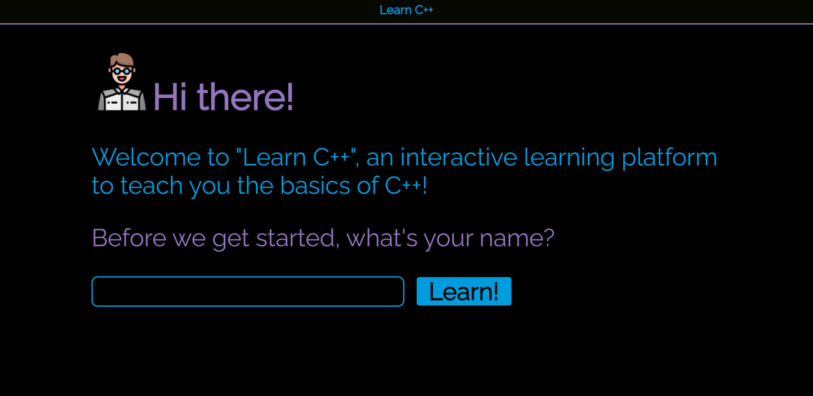
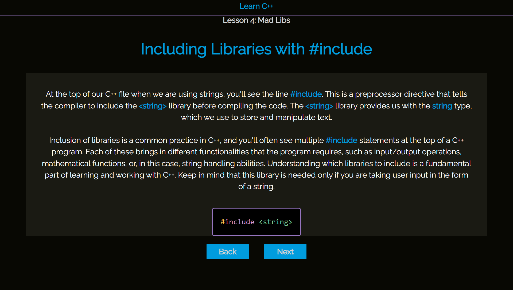
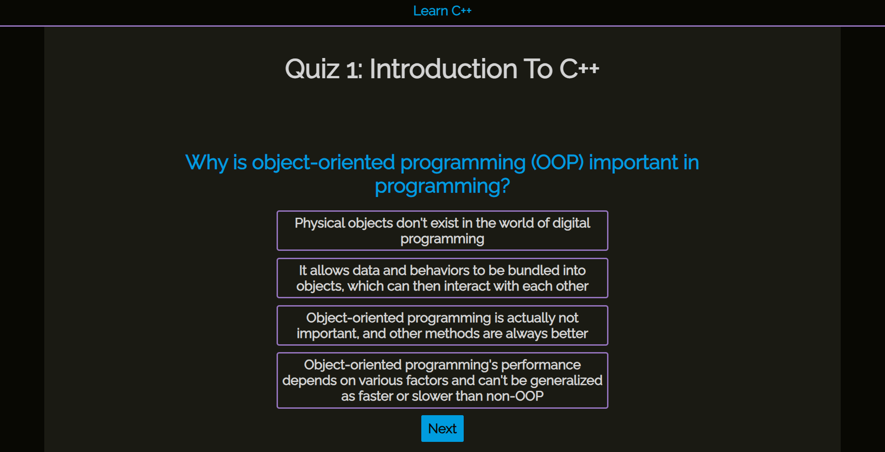

# **Learn C++**

## **Table of Contents**
- [License](#license)
- [Project Overview](#project-overview)
- [Landing Page](#landing-page)
- [Lesson Example](#lesson-example)
- [Quiz Example](#quiz-example)
- [Challenge Example](#challenge-example)
- [Purpose and Inspiration](#purpose-and-inspiration)
- [Unique Technologies](#technologies)
- [Functionality and Features](#functionality-and-features)
- [Technologies Used](#technologies-used)
- [Deployment](#Deployment)
- [Testing](#testing)

## **License**
This project is licensed under the MIT license.

## **Project Overview**
"Learn C++" is an innovative, hands-on learning platform that focuses on practicality, starting with real-world projects and dissecting them to teach users the fundamentals of C++. The platform engages users through a combination of interactive lessons, quizzes, and challenges, effectively fostering a deep understanding of C++ basics. 

## **Landing Page**

## **Lesson Example**

## **Quiz Example**

## **Challenge Example**

## **Purpose and Inspiration**
Jay Padrnos approached me with a unique request - he was keen on learning C++, but not in the conventional way. Jay wanted to try a more hands-on approach that allowed him to engage with the language directly. He proposed an interesting challenge for me: to create a learning platform that starts with projects and then deconstructs them, contrary to the traditional method of learning code first and then applying it. Embracing this fresh perspective, I embarked on designing a platform tailored to Jay's learning style, all the while fostering his curiosity and passion for C++.

## **Unique Technologies**
**TypeScript:**
TypeScript is a statically-typed superset of JavaScript, developed by Microsoft to catch common errors early in the development process. It allows developers to specify types for variables and function parameters, providing better tooling and documentation. Once TypeScript code is written, it's compiled into JavaScript, enabling it to run in any JavaScript environment.

## **Functionality and Features**
The project is split into three sections: Lessons, Quizzes, and Challenges. Each section has a final project the user will end up building, and each lesson is designed to break down each new line of code and explain its purpose in the project. 

Quizzes are meant to test the basics of the lessons, with one question dedicated to each lesson. If the user is taking notes, which is encouraged in the 'Tutorials' sections, the user should have no problem. 

Finally, the challenges are designed for the user to build the section's project from 'scratch'. The user is given starter code, but as the challenges get harder, they start with less starter code. It is also encouraged to repeat the challenge over and over, starting with less and less starter code, until they can complete the challenge without any starter code.

I made the decision to use dangerouslySetInnerHTML for this particular project because the data being loaded into the application is static and fully under my control, which eliminates the risk of XSS attacks. However, I'm fully aware of the security implications and in a production application where user-generated or external data is being handled, I would certainly use a different approach to mitigate security risks.

## **Technologies Used**
* React.js
* TypeScript (JavaScript)
* CSS
* HTML
* Styled-components

## **Deployment**
[Deployment Link](https://learn-c-plus-plus.netlify.app/)

## **Testing**
Here is the coverage table for the projects tests:

File                               | % Stmts | % Branch | % Funcs | % Lines | Uncovered Line #s    
-----------------------------------|---------|----------|---------|---------|----------------------
All files                          |   90.62 |    68.75 |   78.72 |   91.59 |                      
 src                               |     100 |      100 |   66.66 |     100 |                      
  App.tsx                          |     100 |      100 |   66.66 |     100 |                      
 src/components                    |   78.16 |    53.33 |   62.06 |   79.06 |                      
  Header.tsx                       |   85.71 |      100 |       0 |   85.71 | 4                    
  HomePage.tsx                     |      82 |    66.66 |   77.77 |   83.67 | 22-23,28-31,35-37,83 
  ScoresTemplate.tsx               |      64 |    44.44 |      25 |      64 | 34,39-48,59-63       
  ScrollToTop.tsx                  |     100 |      100 |     100 |     100 |                      
 src/components/Challenges         |   98.79 |      100 |     100 |   98.78 |                      
  Challenge2.tsx                   |     100 |      100 |     100 |     100 |                      
  Challenge4.tsx                   |     100 |      100 |     100 |     100 |                      
  Challenge5.tsx                   |     100 |      100 |     100 |     100 | 
  Challenge6.tsx                   |     100 |      100 |     100 |     100 | 
  Challenge7.tsx                   |     100 |      100 |     100 |     100 | 
  ChallengeLoader.tsx              |    92.3 |      100 |     100 |   91.66 | 17
 src/components/Lessons            |   96.49 |    85.71 |   86.66 |   96.36 | 
  LessonTemplate.tsx               |     100 |      100 |     100 |     100 | 
  Lessons.tsx                      |   93.93 |       90 |   81.81 |   93.54 | 81-87
  LessonsSlider.tsx                |     100 |       75 |     100 |     100 | 48
  index.ts                         |       0 |        0 |       0 |       0 | 
 src/components/Lessons/LessonData |     100 |      100 |     100 |     100 | 
  Lesson1Data.ts                   |     100 |      100 |     100 |     100 | 
  Lesson2Data.ts                   |     100 |      100 |     100 |     100 | 
  Lesson3Data.ts                   |     100 |      100 |     100 |     100 | 
  Lesson4Data.ts                   |     100 |      100 |     100 |     100 | 
  Lesson5Data.ts                   |     100 |      100 |     100 |     100 | 
  Lesson6Data.ts                   |     100 |      100 |     100 |     100 | 
  Lesson7Data.ts                   |     100 |      100 |     100 |     100 | 
 src/components/Quizzes            |   82.53 |     42.1 |    64.7 |   86.66 | 
  QuizSlider.tsx                   |   88.46 |     62.5 |      75 |   95.83 | 19
  QuizTemplate.tsx                 |     100 |      100 |     100 |     100 | 
  Quizzes.tsx                      |   76.47 |    27.27 |      50 |   78.78 | 34-39,45-54,84      
 src/components/Quizzes/QuizData   |     100 |      100 |     100 |     100 | 
  Quiz1Data.ts                     |     100 |      100 |     100 |     100 | 
  Quiz3Data.ts                     |     100 |      100 |     100 |     100 | 
  Quiz4Data.ts                     |     100 |      100 |     100 |     100 | 
  Quiz5Data.ts                     |     100 |      100 |     100 |     100 | 
  Quiz6Data.ts                     |     100 |      100 |     100 |     100 |                      
  Quiz7Data.ts                     |     100 |      100 |     100 |     100 | 
 src/components/Tutorials          |     100 |      100 |     100 |     100 | 
  ChallengeTutorial.tsx            |     100 |      100 |     100 |     100 | 
  LessonTutorial.tsx               |     100 |      100 |     100 |     100 | 
  QuizTutorial.tsx                 |     100 |      100 |     100 |     100 | 
  SiteTutorial.tsx                 |     100 |      100 |     100 |     100 | 